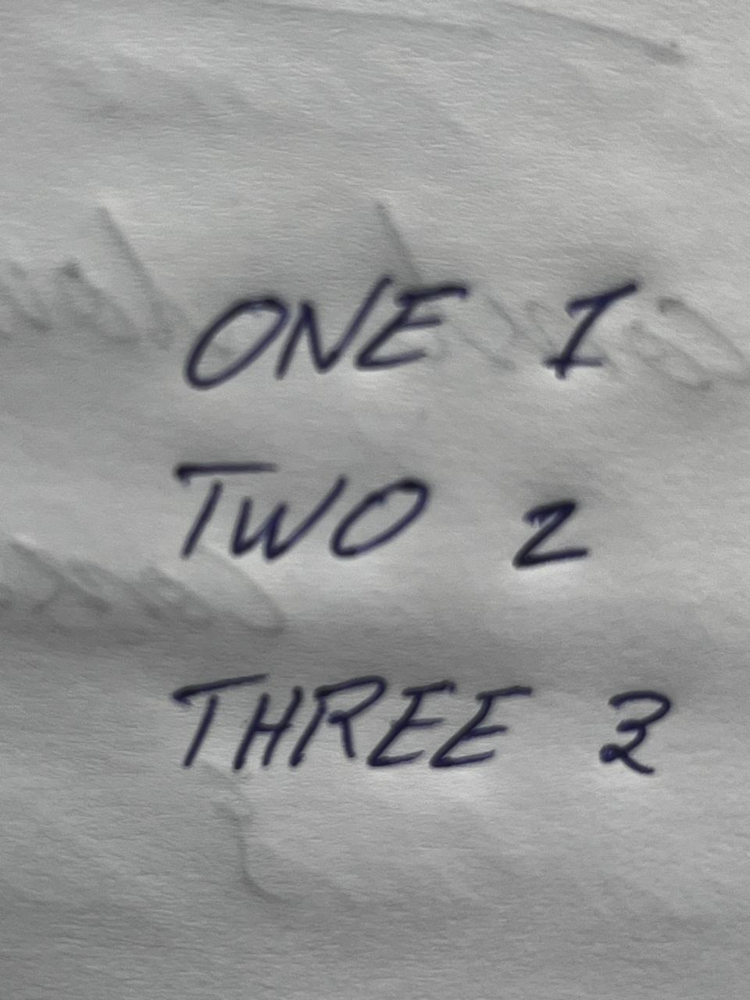

# Handwritten Digit & Character Recognition using CNN

## 🎯 Demo

### Input Image

### Output from Streamlit App

The app correctly detects most handwritten characters and words. Current model shows 98.2% validation accuracy on EMNIST dataset.

## ✨ Features
- Upload any JPG/PNG handwritten image
- Real-time text extraction using CNN
- History panel to track previous predictions
- Built with Streamlit for clean UI

## ⚙️ How to Run
1. `git clone https://github.com/Rahuman002/Handwritten-digit-character-recognition-CNN.git`
2. `pip install -r requirements.txt`
3. `python app.py` or `streamlit run app.py`
4. Open `http://localhost:8501` in browser
